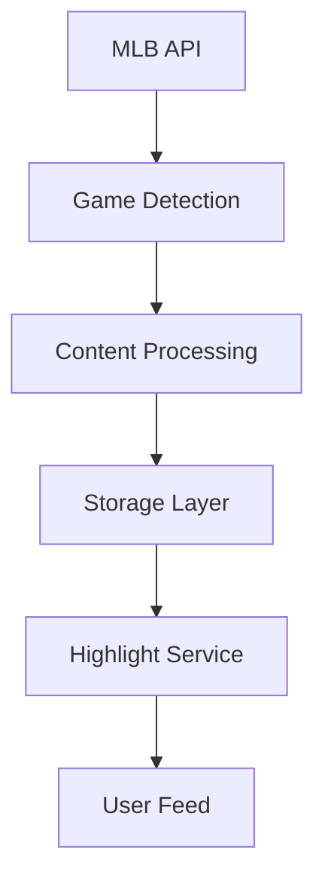

# Building Clutch: A Baseball Journey

## The Ideas That Started It All

### The Animated Companion Dream

The first idea was "SluggerSidekick" - a baseball mascot that lives on your screen while watching games. Picture a little companion that pops up with insights like "99mph fastball incoming!" and celebrates big plays. Simple enough, right?

Well, my first dose of reality came with Rive animations. "Animation can't be that hard," said my naive past self. Five days of struggling later, I had created what could generously be called "modern art" - if modern art was a mascot having a seizure. That was enough to send me back to the drawing board.

### The Video Companion Concept

Next brilliant idea: what if we could have AI watch and analyze any baseball video in real-time? Sounds great until you realize that's like trying to teach a computer to watch baseball while also making it explain what it's seeing. In real-time. Yeah, that was a bit ambitious.

### The Light Bulb Moment

Then it hit me - what if we combined:

- TikTok's addictive short-form content
- Personalized highlights based on your favorite teams
- AI-powered strategic insights
- Interactive features that make you want to learn more

That's when Clutch was born: a TikTok-style app that doesn't just show you highlights, but:

- Serves content based on your team preferences
- Provides strategic insights and statistical analysis for each clip
- Lets you chat with an AI about specific plays
- Saves insights for later reference
- Generates personalized highlight reels for your favorite players

## The Technical Challenges

### Video Processing Pipeline

#### Attempt #1: The Grid Layout Incident

First attempt at video processing: create a grid of video frames and let Gemini analyze them. Sounds reasonable, until Gemini started describing plays that existed only in its digital dreams. AI hallucinations are fun until they're telling you about a triple play that never happened.

#### Attempt #2: The Timestamp Theory

Added timestamps to each frame thinking it would help. Narrator: It did not help. The AI went from making things up to making things up with very specific times attached. Progress?

#### Attempt #3: Scene Detection Debacle

Scene detection seemed promising - until it wasn't. Turns out detecting meaningful baseball scenes is more complex than detecting general video transitions.

#### Attempt #4: The Audio Experiment

Audio analysis came next. The theory was solid: important plays have distinctive audio patterns. Reality wasn't as cooperative.

#### The Final Solution: Embracing Simplicity

In the end, the solution was embarrassingly simple: extract audio, generate transcripts, create structured data. Sometimes the best solution is the one that makes you question all your previous life choices. The result?

```json
{
  "count": "1-1",
  "score": "Braves 4, Phillies 5",
  "stats": {
    "pitchSpeed": "99 MPH"
  },
  "inning": "Bottom of the 9th",
  "summary": "Alvarado throws a 99 MPH sinker...",
  "highlight": "The Phillies come from behind..."
}
```

### The RAG System Architecture

Building a baseball-aware AI required more than just throwing prompts at a model. The RAG system evolved into three core components:

1. **Tool Orchestration**

```typescript
class ToolOrchestrator {
  async queryRoute(query: string, domain: string, context: string) {
    // Determines if and which tools are needed
    // Routes queries to appropriate handlers
  }
}
```

2. **Context Management**

   - Dynamic game context injection
   - Player stats normalization
   - Historical data integration
   - Source verification for factual accuracy

3. **Response Generation**
   - Baseball-specific prompt templates
   - Multi-stage validation
   - Confidence scoring
   - Natural language adaptation

## The Features That Kept Me Up at Night

### 1. The Feed (The Heart of Clutch)

The feed system was built with a focus on simplicity and performance:

- Vertical scrolling interface inspired by TikTok
- Basic view tracking using Redis for seen content
- Simple but effective like/unlike functionality
- MLB API integration for real-time game data

The MLB API integration involved building a robust helper system that handles:

- Schedule and game data retrieval
- Team and player information management
- Game content and highlight fetching
- Proper error handling with custom MLBAPIError class

The real challenge wasn't the API itself, but building a reliable system to:

- Process game schedules efficiently
- Track processing dates using Redis
- Handle game data synchronization
- Manage highlight metadata generation

### 2. Smart Highlights (Making Baseball More Accessible)

The highlight system combines several components:



Each component serves a specific purpose:

1. Content Processing

   - Video playback management
   - Basic metadata extraction
   - Storage optimization

2. Highlight Service

   - Like/unlike functionality
   - Content organization
   - Basic view tracking
   - Playback management

3. Storage Layer
   - Efficient content retrieval
   - Transaction management for user interactions
   - Redis caching for frequently accessed data

### 3. The Baseball Brain (Our Chatty AI Friend)

Remember when I said the AI knows its baseball stuff? Here's what's under the hood:

- RAG system that can actually understand baseball context
- Real-time fact-checking (because nobody likes a know-it-all AI)
- Links to sources (for when you want to prove your friend wrong)
- Custom prompts that make it sound like a real fan, not a textbook

The RAG system was a whole journey:

1. Content Ingestion

   - Web crawling for baseball context
   - Fact verification pipelines
   - Source credibility scoring

2. Query Understanding

   - Baseball-specific intent detection
   - Term disambiguation (because baseball has ALL the jargon)
   - Context preservation across conversations

3. Response Generation
   - Custom prompts for that "real fan" feel
   - Automatic source citation
   - Confidence scoring to avoid BS

The prompts alone took weeks to get right. Try making an AI that can:

- Explain a double play to your grandma
- Break down pitching stats without sounding like a calculator
- Keep the conversation flowing naturally
- Know when to admit it's not sure (harder than you'd think)

### 4. The Dugout (Where Learning Meets Fun)

This one's my favorite. It's a "4 pics 1 word" game but for baseball terms. Why?

- Makes learning baseball terms actually fun
- Different difficulty levels (from "baseball newbie" to "basically an umpire")
- AI-powered hints that don't just give away the answer
- Seriously, people spend hours on this thing

Building this was like creating a mini game engine:

1. Game Mechanics

   - Dynamic difficulty scaling
   - Progress tracking
   - Achievement system
   - Anti-frustration features (because rage-quitting isn't fun)

2. Content Generation

   - Baseball term categorization
   - Difficulty rating algorithms
   - Image selection and validation
   - Hint generation that actually helps

3. Learning System
   - Term relationship mapping
   - Progress tracking
   - Adaptive difficulty
   - Engagement optimization

### 5. Player Matchups (The Stats Storyteller)

The matchup system is built around a sophisticated AI engine that analyzes player performance:

1. **Core Analysis Engine**

   - Position-specific stat analysis
   - Custom visualization algorithms
   - Gemini-powered natural language insights
   - Multi-attempt retry mechanisms for reliability

2. **Player Stats Processing**

   - Dynamic stat extraction based on position
   - Comprehensive error handling
   - Automatic stat normalization
   - Redis-based caching for performance

3. **Insight Generation**
   - Player-of-the-day determination
   - Trend analysis with visualization
   - Multi-factor scoring system
   - Context-aware stat comparisons

Key Features:

- Automatic retry with exponential backoff
- Transaction-safe state management
- Position-specific stat selection
- Parallel stat processing
- Intelligent player scoring
- Natural language insights

---

## Let not forget this were built while having a 9-5 job and taking my exams as well
