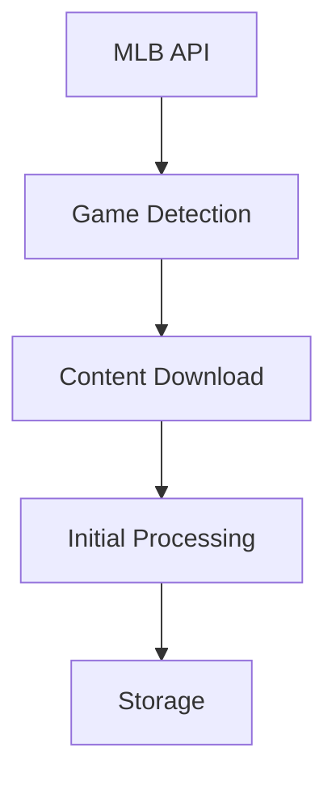
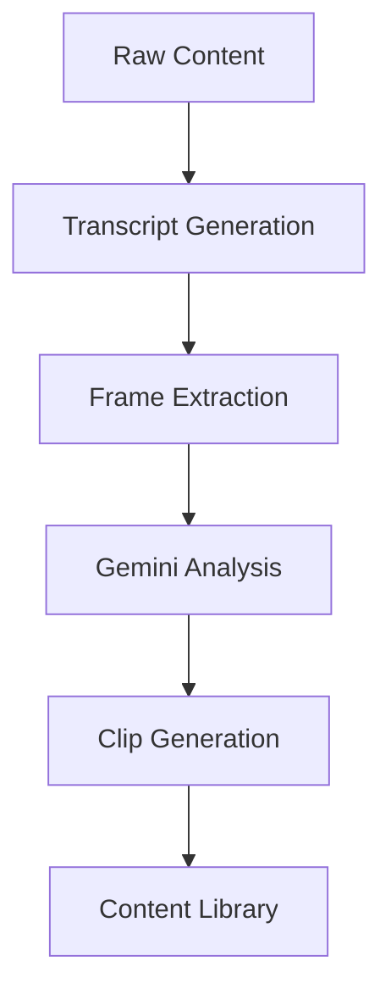
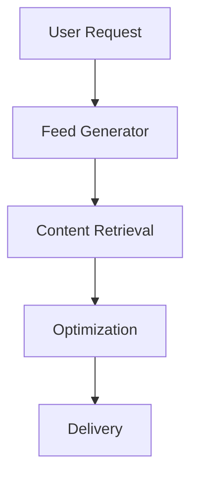

# MLB Highlights App - System Design Document

## System Overview

A TikTok-style baseball highlights application that uses AI to automatically identify, clip, and explain key moments from games.

## Core Components

### 1. Data Sources

- MLB API for game data and schedules
- Video feeds from MLB content API
- Team and player statistics
- Historical game data

### 2. Processing Pipeline

#### Stage 1: Content Collection

- Monitor MLB API for new games
- Download full game videos or existing highlights
- Gather associated metadata (game info, teams, players)
- Store raw content temporarily

#### Stage 2: Video Analysis

- Extract video transcripts with timestamps
- Capture key frames at regular intervals
- Package video segments with transcripts
- Send to Gemini for multimodal analysis

#### Stage 3: AI Processing

- Gemini analyzes video + transcript combinations
- Identifies key moments based on:
  - Player appearances
  - Important plays
  - Crowd reactions
  - Statistical significance
- Returns timestamp ranges for clip extraction

#### Stage 4: Content Generation

- FFMPEG processes clips based on timestamps
- Generates mobile-optimized versions
- Creates thumbnails
- Adds overlays and captions

### 3. Content Management System

#### Content Organization

- Categorize clips by:
  - Teams
  - Players
  - Play types
  - Game importance
  - User engagement metrics

#### Metadata Management

- Store clip information
- Track relationships between clips
- Maintain user interaction data
- Handle multi-language support

### 4. User Experience

#### Feed Generation

- Personalized based on user preferences
- Mix of latest and popular content
- Smart content rotation
- Learning from user interactions

#### Interaction Layer

- Like/Save functionality
- Share capabilities
- User comments
- AI-powered Q&A about clips

## System Architecture

### Frontend Architecture

1. Main Feed View

   - Vertical scroll interface
   - Video player component
   - Interaction buttons
   - Stats overlay

2. Discovery Interface

   - Team browser
   - Player finder
   - Search functionality
   - Filters

3. User Profile
   - Preferences manager
   - Saved clips
   - History
   - Settings

### Backend Architecture

1. API Layer

   - User management
   - Content delivery
   - Interaction handling
   - Analytics

2. Processing Layer

   - Video processing queue
   - AI analysis pipeline
   - Content optimization
   - Cache management

3. Storage Layer
   - Video content
   - User data
   - Analytics
   - Metadata

## Processing Workflows

### 1. Content Acquisition

### 2. Highlight Generation

### 3. Content Delivery

## Key Considerations

### Performance

1. Processing Efficiency

   - Parallel processing where possible
   - Smart queuing system
   - Resource management

2. Content Delivery
   - CDN integration
   - Edge caching
   - Progressive loading

### Scalability

1. Processing Pipeline

   - Horizontal scaling
   - Load balancing
   - Queue management

2. Storage
   - Content distribution
   - Database sharding
   - Cache strategies

### Quality Control

1. Content Verification

   - Clip quality checks
   - Metadata validation
   - User feedback loop

2. AI Accuracy
   - Confidence thresholds
   - Manual review triggers
   - Continuous learning

### Basic Game Terms

- **Inning**: Game period (9 innings in a game)
- **Top/Bottom**: First/second half of an inning
- **Out**: When a batter or runner is eliminated (3 outs end an inning)
- **Run**: A point scored
- **Score**: Format is "Team A - Team B" (e.g., "5-3")

### Offensive Terms

- **Hit**: Successfully striking the ball
- **Single**: Reaching first base on a hit
- **Double**: Reaching second base on a hit
- **Triple**: Reaching third base on a hit
- **Home Run**: Hitting the ball out of play, scoring a run
- **RBI (Run Batted In)**: When a batter's action leads to a run

### Defensive Terms

- **Strike**: Missed/invalid hit attempt (3 strikes = out)
- **Ball**: Pitch outside strike zone (4 balls = walk)
- **Strikeout**: When a batter gets 3 strikes
- **Catch**: Fielder catches hit ball before it touches ground
- **Double Play**: Two outs in one play

### Field Positions

- **Pitcher**: Player who throws the ball
- **Batter**: Player hitting the ball
- **Catcher**: Player behind home plate
- **Infield**: Area with bases
- **Outfield**: Area beyond bases

### Common Plays

- **Base Hit**: Ball hit into play allowing runner to reach base
- **Fly Ball**: Ball hit high in the air
- **Ground Ball**: Ball hit on the ground
- **Base Running**: Movement between bases
- **Steal**: Runner advances during pitch

### Game Situations

- **Bases Loaded**: Runners on all bases
- **Full Count**: 3 balls, 2 strikes
- **Walk-Off**: Winning play in final inning
- **Save**: Preserving a close lead to win

This terminology will help Gemini identify and describe key moments in game footage.

## Implementation Phases

### Phase 1: Foundation (Week 1)

- Basic system setup
- MLB API integration
- Simple video processing
- Basic frontend

### Phase 2: Intelligence (Week 2)

- Gemini integration
- Transcript processing
- Clip generation
- Basic personalization

### Phase 3: Polish (Week 3)

- UI/UX refinement
- Performance optimization
- Error handling
- Testing and validation

## Risk Assessment

### Technical Risks

1. Video Processing Load

   - Mitigation: Efficient queuing and scaling
   - Backup: Fallback to simpler processing

2. AI Accuracy

   - Mitigation: Confidence thresholds
   - Backup: Manual review system

3. Content Rights
   - Mitigation: Strict MLB API compliance
   - Backup: Content filtering system

### Operational Risks

1. System Load

   - Mitigation: Load balancing
   - Backup: Content caching

2. Data Storage
   - Mitigation: Efficient storage strategy
   - Backup: Content pruning system

## Success Metrics

### User Engagement

- Daily active users
- Time spent in app
- Clip completion rate
- Share/save rates

### Technical Performance

- Processing speed
- AI accuracy
- System uptime
- Response times

### Content Quality

- User ratings
- Clip relevance
- AI explanation accuracy
- User retention

## Future Enhancements

### Potential Features

1. Live Game Integration
2. Social Features
3. Advanced Statistics
4. Custom Highlights
5. Multiple Sports Support

### Technical Improvements

1. Advanced AI Models
2. Real-time Processing
3. Enhanced Personalization
4. AR/VR Integration

### Self Notes

Here's what i think would be the goto workflow:

- fetch all teams within specific season
- for each team, get the schedule for that season and team.
- get live game

## Video Processing Evolution: Issues & Solutions

- **Version 1**: Grid layout was too rigid and Gemini kept hallucinating on frame text detection - not reliable at all 🤖

- **Version 2:** Text overlays still unreadable and grid system keeps breaking with different video lengths 📏

- **Version 3:** Scene transitions are a mess and there's no way to identify if a moment is actually important 🎬

- **Version 4:** Scene detection is completely random and transitions look like they're from Windows Movie Maker 2000 😅

- **Version 5:** Clips are overlapping everywhere and scenes keep getting duplicated - this isn't working 🔄

- **Version 6:** Scene detection improved but it's slower than a snail and still can't understand what's happening in the video 🐌

- **Version 7:** Switched to audio analysis but keyword detection is missing half the important plays - not good enough for sports 🏃‍♂️

- **Version 8 (Final):** Combined audio and visual with baseball keywords - still has overlap issues but at least it catches the important moments now 🎯

- **Version 9 (Latest):** Completely new approach focusing on transcript-first, using subtitles as source of truth, and LLM for context analysis - no more scene detection headaches! 🎉

## Player Stats Endpoint

https://statsapi.mlb.com/api/v1/people/700363/stats?stats=gameLog
